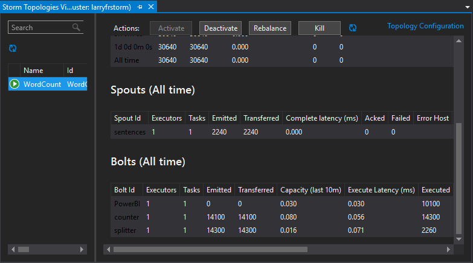
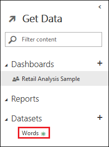
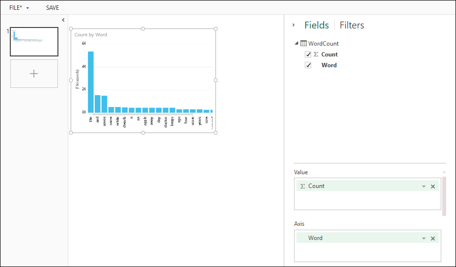
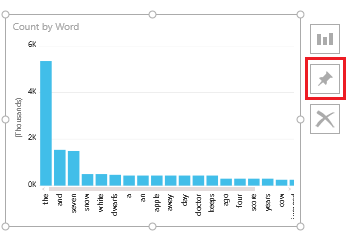
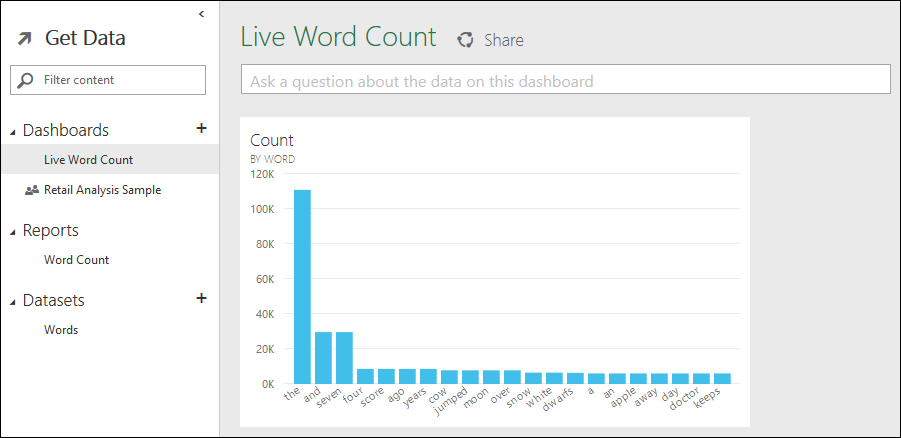

# hdinsight-dotnet-storm-powerbi
This sample demonstrates how to use Power BI (powerbi.com,) to display information generated by a C#-based Apache Storm topology running on HDInsight.

## Configure and deploy

Important - Power BI seems to allow the creation of multiple datasets with the same name. This can occur if the dataset does not exist, and your topology creates multiple instances of the Power BI Bolt. To avoid this, either set the parallelism hint of the bolt to 1 (as this example does,) or create the dataset before deploying the topology.

The **CreateDataset** console application included in this solution is provided as an example of how to create the dataset outside of the topology.

### Register a Power BI application

1. Follow the steps in the [Power BI quickstart](https://msdn.microsoft.com/library/dn931989.aspx) to sign up for Power BI.

2. Follow the steps in [Register an app](https://msdn.microsoft.com/library/dn877542.aspx) to create an application registration. This will be used when accessing the Power BI REST API.

	Important - Save the **Client ID** for the application registration.

### Configure the sample

1. Open the sample project in Visual Studio. From **Solution Explorer**, open the **App.config** file, and then find the **<OAuth .../>** element. Enter values for the following properties of this element.

    * **Client**: The Client ID for the application registration you created earlier.

    * **User**: An Azure Active Directory account that has access to Power BI.

    * **Password**: The password for the Azure Active Directory account.

2. (Optional). The default dataset name used by this project is **Words**. To change this, right click on the **WordCount** project in **Solution Explorer**, select **Properties**, and then select **Settings**. Change the **DatasetName** entry to the desired value.

3. Save and close the files.

###Deploy the sample

1. From **Solution Explorer**, right-click the **WordCount** project and select **Submit to Storm on HDInsight**. Select the HDInsight cluster from the **Storm Cluster** dropdown dialog.

    It may take a few seconds for the **Storm Cluster** dropdown to populate with server names.
    
    If prompted, enter the login credentials for your Azure subscription. If you have more than one subscription, log in to the one that contains your Storm on HDInsight cluster.

2. When the topology has been successfully submitted, the Storm Topologies for the cluster should appear. Select the WordCount topology from the list to view information about the running topology.

    

3. When viewing the **Topology Summary**, scroll until you see the **Bolts** section. In this section, note the **Executed** column for the **PowerBI** bolt. Use the refresh button at the top of the page to refresh until the value changes to something other than zero. When this number starts to increase, it indicates that items are being written to Power BI.

## Create a report

1. In a browser, visit [https://PowerBI.com](https://powerbi.com). Sign in with your account.

2. On the left side of the page, expand **Datasets**. Select the **Words** entry. This is the dataset created by the example topology.

    

3. From the **Fields** area, expand **WordCount**. Drag the **Count** and **Word** entries to the middle part of the page. This will create a new chart that displays a bar for each word indicating how many times the word has occurred.

    

4. From the upper left of the page, select **Save** to create a new report. Enter **Word Count** as the name of the Report.

5. Select the Power BI logo to return to the dashboard. The **Word Count** report now appears under **Reports**.

### Create a live dashboard

1. Beside **Dashboard**, select the **+** icon to create a new dashboard. Name the new dashboard **Live Word Count**.

2. Select the **Word Count** report you created earlier. When displayed, select the chart, then select the pushpin icon to the upper right of the chart. You should receive a notification that it was pinned to the dashboard.

    

2. Select the Power BI logo to return to the dashboard. Select the **Live Word Count** dashboard. It now contains the Word Count chart, and the chart updates as new entries are sent to Power BI from the WordCount topology running on HDInsight.

    

## Stop the WordCount topology

The topology will continue to run until you stop it or delete the Storm on HDInsight cluster. Perform the following steps to stop the topology.

1. In Visual Studio, open the **Topology Summary** window for the WordCount topology. If the Topology Summary is not already open, go to **Server Explorer**, expand the **Azure** and **HDInsight** entries, right-click on the Storm on HDInsight cluster and select **View Storm Topologies**. Finally, select the **WordCount** topology.

2. Select the **Kill** button to stop the **WordCount** topology.

    