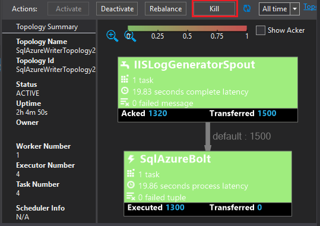

# hdinsight-dotnet-storm-powerbi
This sample demonstrates how to use Power BI (powerbi.com,) to display information generated by a C#-based Apache Storm topology running on HDInsight. Data is stored into SQL Database, then used to create a report in Power BI.

## SCP.NET package version

The SCP.NET package version that you use for this project depends on the version of Storm installed on your HDInsight cluster. Use the following table to determine what SCP.NET version you must use in your project:

| HDInsight version | Apache Storm version | SCP.NET version |
|:-----------------:|:--------------------:|:---------------:|
| 3.3 | 0.10.# | 0.10.#.# |
| 3.4 | 0.10.# | 0.10.#.# |
| 3.5 | 1.0.# | 1.0.#.# |

## Create a database

1. Use the steps in the [SQL Database tutorial](https://azure.microsoft.com/documentation/articles/sql-database-get-started/) document to create a new SQL Database.

2. Connect to the database by following the steps in the [Connect to a SQL Database with Visual Studio](https://azure.microsoft.com/documentation/articles/sql-database-connect-query/) document to connect to the database.

4. Right click on the database in Object Explorer and create a __New Query__. Paste the contents of the __IISLogsTable.sql__ included in the downloaded project into the query window, and then use Ctrl + Shift + E to execute the query. You should receive a message that the command(s) completed successfully.

    Once this completes, there will be a new table named __IISLOGS__ in the database.

## Configure the sample

1. From the [Azure portal](https://portal.azure.com,) select your SQL database. From the __Essentials__ section of the SQL database blade, select __Show database connection strings__. From the list that appears, copy the __ADO.NET (SQL authentication)__ information.

1. Open the sample in Visual Studio. From **Solution Explorer**, open the **App.config** file, and then find the following entry:

        <add key="SqlAzureConnectionString" value="##TOBEFILLED##" />
    
    Replace the __##TOBEFILLED##__ value with the database connection string copied in the previous step. Replace __{your\_username}__ and __{your\_password}__ with the username and password for the database.

2. Save and close the files.

## Deploy the sample

1. From **Solution Explorer**, right-click the **StormToSQL** project and select **Submit to Storm on HDInsight**. Select the HDInsight cluster from the **Storm Cluster** dropdown dialog.

    > [AZURE.NOTE] It may take a few seconds for the **Storm Cluster** dropdown to populate with server names.
    >
    > If prompted, enter the login credentials for your Azure subscription. If you have more than one subscription, log in to the one that contains your Storm on HDInsight cluster.

2. When the topology has been successfully submitted, the Storm Topologies for the cluster should appear. Select the SqlAzureWriterTopology entry from the list to view information about the running topology.

    

    You can use this view to see information on the topology, or double-click on entries (such as the SqlAzureBolt) to see information specific to a component in the topology.

3. After the topology has ran for a few minutes, return to the SQL query window you used to create the database. Replace the existing statements with the following.

        select * from iislogs;
    
    Use Ctrl + Shift + E to execute the query, and you should receive results similar to the following.
    
        1	2016-05-27 17:57:14.797	255.255.255.255	/bar	GET	200
        2	2016-05-27 17:57:14.843	127.0.0.1	/spam/eggs	POST	500
        3	2016-05-27 17:57:14.850	123.123.123.123	/eggs	DELETE	200
        4	2016-05-27 17:57:14.853	127.0.0.1	/foo	POST	404
        5	2016-05-27 17:57:14.853	10.9.8.7	/bar	GET	200
        6	2016-05-27 17:57:14.857	192.168.1.1	/spam	DELETE	200

    This is data that has been written from the Storm topology.

## Create a report

1. Connect to the [Azure SQL Database connector](https://app.powerbi.com/getdata/bigdata/azure-sql-database-with-live-connect) for Power BI.

2. Within __Databases__, select __Get__.

3. Select __Azure SQL Database__, and then select __Connect__.

4. Enter the information to connect to your Azure SQL Database. You can find this by visiting the [Azure portal](https://portal.azure.com) and selecting your SQL database.

    > [AZURE.NOTE] You can also set the refresh interval and custom filters by using __Enable Advanced Options__ from the connect dialog.

5. After you've connected, you will see a new dataset with the same name as the database you connected to. Select the dataset to begin designing a report.

3. From __Fields__, expand the __IISLOGS__ entry. Select the checkbox for __URISTEM__. This will create a new report that lists the URI stems (/foo, /bar, etc.) logged in the database.

    

5. Next, drag __METHOD__ to the report. The report will update to list the stems and the corresponding HTTP method used for the HTTP request.

    

4. From the __Visualizations__ column, select the __Fields__ icon, and then select the down arrow next to __METHOD__ in the __Values__ section. From the list that appears, select __Count__. This will change the report to list a count of how many times a specific URI has been accessed.

    

6. Next, select the __Stacked column chart__ to change how the information is displayed.

    

7. Once you have the report how you want it, use the __Save__ entry on the menu to enter a name and save the report.

## Stop the topology

The topology will continue to run until you stop it or delete the Storm on HDInsight cluster. Perform the following steps to stop the topology.

1. In Visual Studio, return to the topology viewer and select the topology.

2. Select the **Kill** button to stop the topology.

    

## Project code of conduct

This project has adopted the [Microsoft Open Source Code of Conduct](https://opensource.microsoft.com/codeofconduct/). For more information see the [Code of Conduct FAQ](https://opensource.microsoft.com/codeofconduct/faq/) or contact [opencode@microsoft.com](mailto:opencode@microsoft.com) with any additional questions or comments.